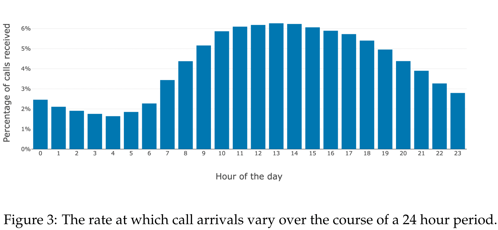
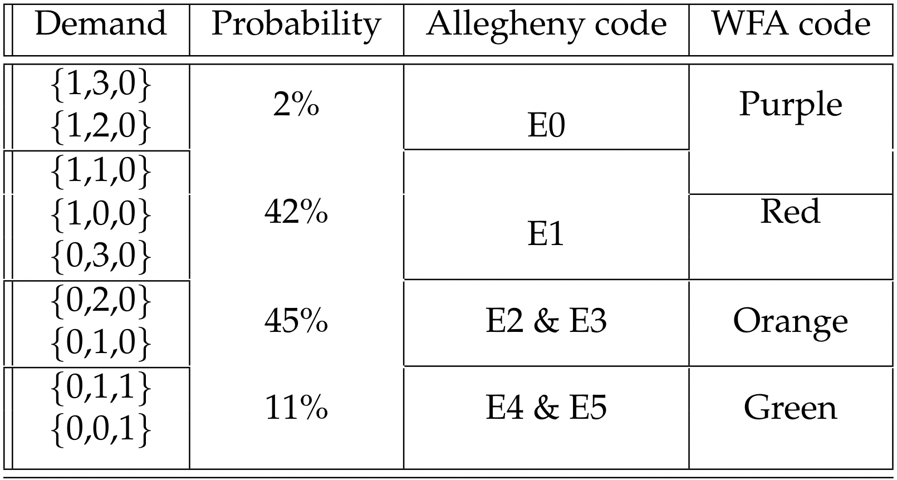

# EMS Instance Creation

This directory contains the notebook(s) necessary to generate Ambulance Dispatch instances. Notebooks will be added here as larger instances are created.

The general outline of all notebooks is as follows:
* Import a baseline graph. This may be the likes of CARP instances (e.g. EGL-G) or a graphical representation of a real-world city from OpenStreetMap.
* Determine several Ambulance-specific parameters. e.g. the number of facilities & hospitals, the number of each type of vehicle, etc.
* Calculate the expected travel time along each arc by assuming a standard traversal speed (e.g. 50kmph).
* Determine the number of 'days' (instances) you wish to generate. For each day:
  * Randomly place the facilities, hospitals, and starting facility of each vehicle (adhering to facility capacity).  
  * For each day, generate a random number of calls given a daily temporal distribution as shown in the graph below. This trend was obseved in several studies [\cite{}] before we additionally obversed it in the Marin dataset [\cite{}] (whose data we use for generation).   

<p align="center">

</p>

* Each call has several characteristics randomly assigned:
  * The arc upon which the call is located, which is uniformly randomly sampled from the graph. Additionally, we randomly select a fractional point along the arc at which the emergency actually takes place (to simulate a street address).  
  * Whether or not the patient requires hospitalisation. For this we set a 95% rate for the top four demand (below) tiers, and 60% for the remaining. This is approximately in line with the rates observed in Australia [\cite{}] and New Zealand [\cite{}].
  * The treatment time required on-site per unit of demand. We have little real-world data on this aspect, thus use anecdotal evidence from contacts with Wellington Free Ambulance to define an appropriate range of [20, 40].
  * The number of minutes
  * Emergency demand, i.e. how many of each type of ambulance is requested, is in the form of an integer array (e.g. [1,3,0]). From demand we can implicitly infer call urgency. Demand is set according to a random distribution following urgency data provided by Wellington Free Ambulance [\cite{}] and the Allegheny County (USA) [\cite{}] emergency services, as shown in the following table. The 'Probability' column (2) highlights the final value used in our method. Demand values that share a probability are uniformly sampled.  

<p align="center">

</p>

We have published the following working using these data: 

* Title of fantastic paper #1 [\cite{}]
* etc


If you are to use these data in your own work, please cite us using the following Bibtex entry: 

```
@misc{maclachlan2022,
    title={Emergency Medical Services Instance Creation},
    author={MacLachlan, Jordan and Mei, Yi and Zhang, Fangfang and Zhang, Mengjie},
    url={https://github.com/maclachlanjj/ems_instance_creation},
    year={2022}
}
```
